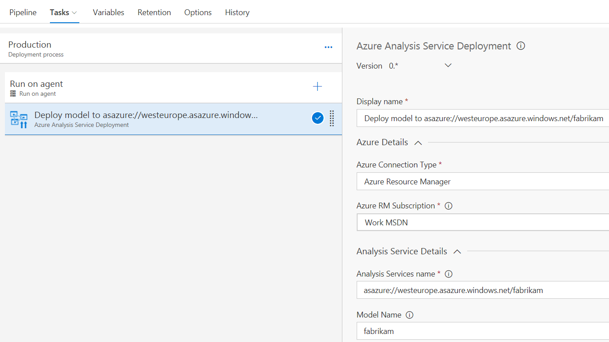
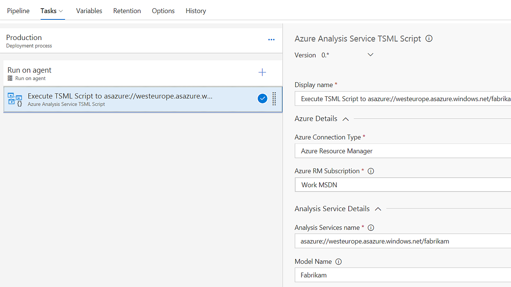

# Azure Analysis Service

This extension adds release tasks related to Azure Analysis Service to Visual Studio Team Service.

## Azure Analysis Service Deployment

Visual Studio Team Service deploy task that will deploy a Tabular model to an existing Azure Analysis Service instance. Also option to change the connected source datasource during release.

At this moment the following configuration are tested and working:
- Model 1400 and a single SQL Server database as datasource

More configuration will follow. Feel free to contact me for a specific configuration.

[More information](deploy-aas-db/README.md)

## Azure Analysis Service TMSL Script

This release task can be added to a release pipeline to execute a custom TMSL script against an Azure Analysis Service instance.

[More information](execute-aas-tmsl/README.md)

## Release notes

**1.3.0**
- Support for legacy datasources

**1.2.0**
- Add support for service principal deployments
- Add support for adding firewall rules

**1.1.3**
- New: Execute TMSL Script can now have a folder with scripts as input
- Bugfix: Corrected typo TMSL

**1.1.0**
- New: AAS return messages (error/warning) are used for the tasks logging
- Bugfix: Better logging when exceptions are thrown

**1.0.1**
- Initial public release